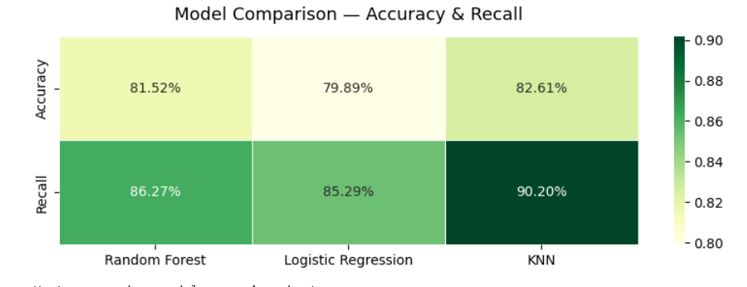

# 🫀 Heart Disease Prediction

An end-to-end machine learning project that predicts the presence of heart disease from clinical data, comparing three classification algorithms on the UCI Heart Disease Dataset.

---

## 📌 Overview

Heart disease is one of the leading causes of death worldwide. Early and accurate detection can save lives. This project builds and evaluates machine learning models that predict whether a patient has heart disease based on clinical features such as age, cholesterol level, resting blood pressure, and maximum heart rate.

**Type:** Binary Classification  
**Dataset:** [UCI Heart Disease Dataset](https://www.kaggle.com/datasets/redwankarimsony/heart-disease-uci)  
**Best Result:** KNN — 82.61% Accuracy | 90.20% Recall

---

## 📊 Model Comparison

| Model               | Accuracy   | Recall     |
|---------------------|------------|------------|
| **KNN**             | **82.61%** | **90.20%** |
| Random Forest       | 81.52%     | 86.27%     |
| Logistic Regression | 79.89%     | 85.29%     |

> **Why recall?** In a medical context, missing a true positive (failing to detect heart disease) is far more dangerous than a false alarm. Recall was therefore prioritized over raw accuracy.



---

## 🗂️ Project Structure

```
heart-disease-prediction/
│
├── heart_disease_prediction.ipynb   # Main notebook
├── model_comparison_heatmap.png     # Model evaluation visual
├── .gitignore
└── README.md
```

---

## ⚙️ Pipeline

1. **Data Loading** — UCI Heart Disease Dataset (303 patients, 14 features)
2. **Data Cleaning**
   - Dropped unreliable columns: `id`, `thal`, `ca`, `dataset`
   - Fixed impossible values: cholesterol = 0 replaced with median
   - Corrected negative `oldpeak` values
   - Filled missing values (numeric → median, categorical → mode)
3. **Exploratory Data Analysis**
   - Distribution plots per feature
   - Heart disease ratio by age group
   - Correlation heatmap
4. **Feature Engineering**
   - `age_over50` — binary flag for patients over 50
   - `chol_high` — binary flag for cholesterol > 240
   - `old_angina_risk` — combined risk flag
   - One-hot encoding of categorical variables
5. **Modeling**
   - Train/test split: 80/20 with stratification
   - StandardScaler applied to Logistic Regression and KNN
   - Random Forest trained without scaling (tree-based, not required)
6. **Evaluation**
   - Accuracy, Recall, F1-score, Confusion Matrix for each model
   - Permutation feature importance for KNN

---

## 🛠️ Tech Stack

- **Python 3.12**
- **pandas** — data manipulation
- **numpy** — numerical operations
- **matplotlib / seaborn** — visualization
- **scikit-learn** — modeling and evaluation

---

## 🚀 How to Run

1. Clone the repository
```bash
git clone https://github.com/mohamedazizweili/heart-disease-prediction.git
cd heart-disease-prediction
```

2. Install dependencies
```bash
pip install pandas numpy matplotlib seaborn scikit-learn
```

3. Download the dataset from [Kaggle](/kaggle/input/heart-disease/heart_disease_uci.csv) and place it in the project folder

4. Open and run the notebook
```bash
jupyter notebook heart_disease_prediction.ipynb
```

---

## 🔮 Next Steps

- [ ] Tune hyperparameters with GridSearchCV
- [ ] Test XGBoost and SVM for potential performance gains
- [ ] Add cross-validation for more robust evaluation
- [ ] Build a simple prediction interface with Streamlit

---

## 👤 Author

**Mohamed Aziz Weili**  
[LinkedIn](www.linkedin.com/in/mohamed-aziz-weili-a49977398) • [GitHub]([https://github.com/mohamedazizweili](https://github.com/mohamedazizweili))
